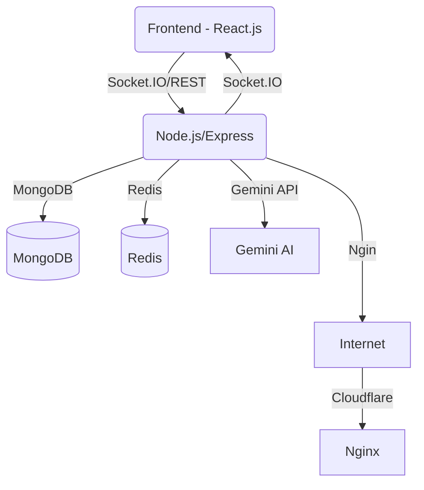

# Project Management AI Assistant

## 1. Giới thiệu

**Tên hệ thống:** Project Management AI Assistant

**Mục tiêu:**

-   Quản lý dự án, công việc, thành viên.
-   Tích hợp AI (Gemini API) để: nhắc nhở thông minh, dự đoán tiến độ, chatbot hỗ trợ.
-   Hỗ trợ nhóm phát triển phần mềm hoặc nhóm làm việc theo Agile/Scrum/Kanban.

## 2. Đối tượng sử dụng

-   **Admin:** Quản lý toàn bộ hệ thống, phân quyền người dùng.
-   **Project Manager (PM):** Tạo dự án, quản lý sprint, phân công task, theo dõi báo cáo.
-   **Member:** Nhận công việc, cập nhật tiến độ, chat, trao đổi.
-   **Guest/Client:** Có thể xem trạng thái dự án (chỉ đọc).

## 3. Yêu cầu chức năng (Functional Requirements)

### 3.1. Quản lý người dùng

-   Đăng ký, đăng nhập, phân quyền (Admin, PM, Member, Guest)
-   Quản lý thông tin cá nhân, đổi mật khẩu, quên mật khẩu
-   Quản lý trạng thái hoạt động, đăng xuất

### 3.2. Quản lý dự án (Project Management)

-   Tạo, chỉnh sửa, xóa dự án
-   Gán thành viên, phân quyền trong dự án
-   Quản lý trạng thái dự án (đang thực hiện, hoàn thành, tạm dừng)

### 3.3. Quản lý công việc (Task/Issue Management)

-   Tạo, chỉnh sửa, xóa, phân công task/issue
-   Quản lý trạng thái (To do, In progress, Review, Done)
-   Gán nhãn, ưu tiên, deadline, file đính kèm

### 3.4. Sprint & Board

-   Tạo sprint, quản lý backlog, kéo thả task giữa các cột (Kanban)
-   Theo dõi tiến độ sprint, burn down chart

### 3.5. Chat & Cộng tác

-   Chat nhóm, chat riêng, gửi file, nhắc tên
-   Thông báo realtime qua Socket.IO

### 3.6. Thông báo & Nhắc nhở

-   Thông báo hệ thống, nhắc nhở deadline, nhắc nhở AI
-   Tùy chỉnh nhận thông báo

### 3.7. Báo cáo & Dashboard

-   Báo cáo tiến độ, hiệu suất cá nhân/nhóm
-   Dashboard trực quan: biểu đồ, thống kê

### 3.8. Tích hợp AI

-   Chatbot AI hỗ trợ hỏi đáp, hướng dẫn sử dụng
-   Dự đoán tiến độ, cảnh báo trễ deadline
-   Gợi ý phân chia task, nhắc nhở thông minh

## 6. Sơ đồ kiến trúc hệ thống



## 7. Hướng dẫn cài đặt

### Yêu cầu hệ thống

-   Node.js >= 18
-   MongoDB >= 5
-   Redis >= 6

### Cài đặt backend

```bash
cd backend
npm install
cp .env.example .env # Cấu hình biến môi trường
npm run dev
```

### Cài đặt frontend

```bash
cd frontend
npm install
npm run dev
```

### Khởi động toàn bộ hệ thống (dev)

1. Khởi động MongoDB, Redis
2. Chạy backend và frontend như trên
3. Truy cập http://localhost:5173

## 8. Hướng dẫn sử dụng nhanh

1. Đăng ký tài khoản hoặc đăng nhập bằng tài khoản demo
2. Tạo dự án mới, thêm thành viên
3. Tạo sprint, thêm task, kéo thả task trên Kanban board
4. Sử dụng chat, nhận thông báo, thử hỏi AI chatbot
5. Xem dashboard báo cáo tiến độ

## 4. Yêu cầu phi chức năng (Non-functional Requirements)

-   **Hiệu năng:** Hỗ trợ ít nhất 500+ người dùng đồng thời.
-   **Bảo mật:**
    -   Xác thực JWT.
    -   Hash mật khẩu bằng BCrypt.
    -   Chống XSS, CSRF, SQL Injection.
-   **Khả năng mở rộng:**
    -   Kiến trúc microservice (có thể mở rộng module AI riêng).
    -   Hỗ trợ tích hợp thêm API khác.
-   **Tính sẵn sàng (Availability):** uptime ≥ 99.5%.
-   **Khả năng sử dụng (Usability):** UI thân thiện, drag & drop trực quan.
-   **Khả năng bảo trì (Maintainability):** code clean, có test coverage ≥ 70%.

## 5. Yêu cầu công nghệ

### Backend

-   Node.js (Express.js).
-   MongoDB + Mongoose.
-   Redis (cache + session).
-   Socket.IO (realtime).
-   JWT, BCrypt, Helmet.js, Rate-limiting, CORS.
-   Gemini API (AI chatbot & dự đoán tiến độ).

### Frontend

-   React.js (SPA).
-   React Router, Redux Toolkit / React Query.
-   TailwindCSS, Shadcn/UI.
-   React Beautiful DnD / DndKit (Kanban board).
-   Socket.IO client.
-   Chatbot AI UI.

### Triển khai

-   Nginx (reverse proxy).
-   Domain & hosting: Tenten.
-   Cloudflare (CDN, SSL, bảo mật).
