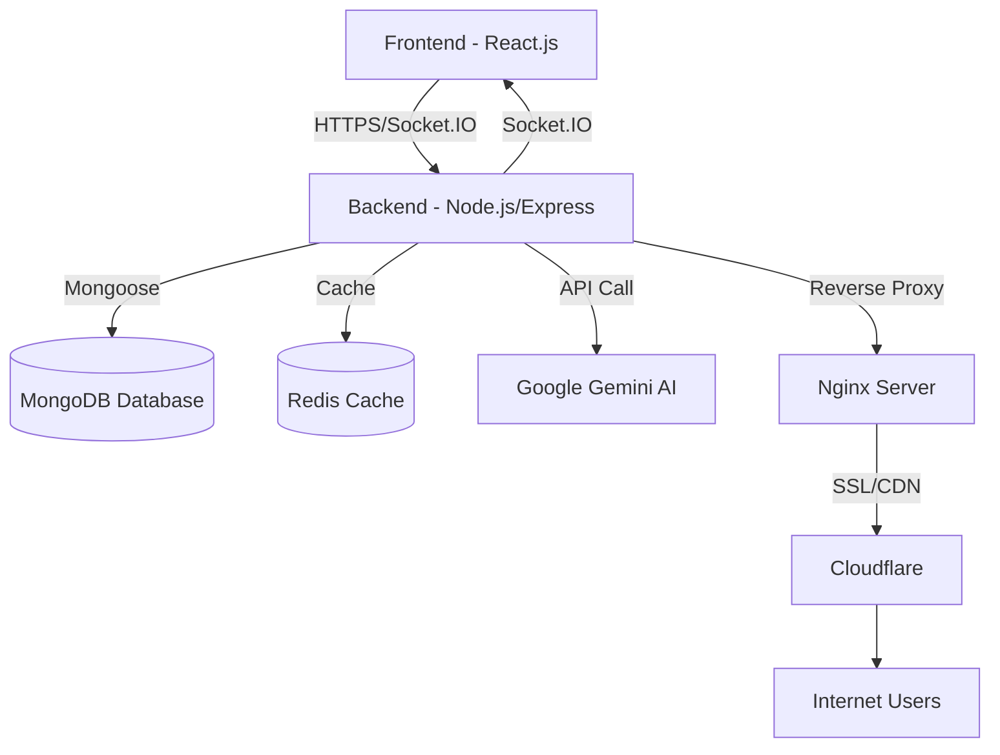

# ProjectAI - Project Management AI Assistant

<div align="center">


**Nền tảng quản lý dự án thông minh với AI Assistant tích hợp**

[Tính năng](#-tính-năng-chính) • [Công nghệ](#-công-nghệ-sử-dụng) • [Cài đặt](#-hướng-dẫn-cài-đặt) • [Sử dụng](#-hướng-dẫn-sử-dụng) • [Đóng góp](#-đóng-góp)

</div>

---

## 📋 Mục lục

-   [Giới thiệu](#-giới-thiệu)
-   [Tính năng chính](#-tính-năng-chính)
-   [Đối tượng sử dụng](#-đối-tượng-sử-dụng)
-   [Công nghệ sử dụng](#-công-nghệ-sử-dụng)
-   [Kiến trúc hệ thống](#-kiến-trúc-hệ-thống)
-   [Hướng dẫn cài đặt](#-hướng-dẫn-cài-đặt)
-   [Hướng dẫn sử dụng](#-hướng-dẫn-sử-dụng)
-   [Yêu cầu phi chức năng](#-yêu-cầu-phi-chức-năng)
-   [Roadmap](#-roadmap)
-   [Đóng góp](#-đóng-góp)
-   [License](#-license)

---

## 🚀 Giới thiệu

**ProjectAI** là một nền tảng web quản lý dự án hiện đại, tích hợp trí tuệ nhân tạo (AI) nhằm tối ưu hóa quy trình làm việc và nâng cao hiệu suất cộng tác nhóm.

### 🎯 Mục tiêu

-   **Quản lý dự án thông minh:** Theo dõi tiến độ, phân công công việc, quản lý tài nguyên hiệu quả
-   **AI Assistant:** Tích hợp Google Gemini API để phân tích dữ liệu, dự đoán rủi ro và đưa ra gợi ý tối ưu
-   **Cộng tác realtime:** Chat nhóm, thông báo tức thời, cập nhật đồng bộ
-   **Trực quan & Dễ sử dụng:** Giao diện hiện đại với Kanban board, biểu đồ tiến độ trực quan

---

## ✨ Tính năng chính

### 👤 Quản lý tài khoản

-   ✅ Đăng ký/Đăng nhập với xác thực JWT
-   ✅ Quên mật khẩu qua email
-   ✅ Quản lý hồ sơ cá nhân (avatar, thông tin liên hệ, mô tả)
-   ✅ Bảo mật với BCrypt (salt ≥ 10)
-   ✅ Rate limiting: Chống brute-force attack

### 📊 Quản lý dự án

-   ✅ Tạo/Chỉnh sửa/Xóa dự án
-   ✅ Mời thành viên qua email hoặc link
-   ✅ Phân quyền chi tiết (Owner/Manager, Member, Viewer)
-   ✅ Theo dõi trạng thái: Đang thực hiện, Tạm dừng, Hoàn thành
-   ✅ Dashboard với biểu đồ tiến độ trực quan

### ✅ Quản lý công việc (Task Management)

-   ✅ Tạo task với đầy đủ thông tin (tiêu đề, mô tả, deadline, độ ưu tiên, nhãn)
-   ✅ Bảng Kanban với drag & drop: To Do → In Progress → Review → Done
-   ✅ Phân công người thực hiện
-   ✅ Cập nhật tiến độ realtime
-   ✅ Xem chi tiết task, lịch sử thay đổi

### 💬 Trò chuyện & Cộng tác

-   ✅ Chat realtime với Socket.IO
-   ✅ Nhắn tin nhóm
-   ✅ Gửi file đính kèm (ảnh, tài liệu, video)
-   ✅ Lưu lịch sử chat

### 🔔 Thông báo thông minh

-   ✅ Thông báo khi có task mới, deadline sắp đến
-   ✅ Thông báo cập nhật dự án
-   ✅ Tùy chọn loại thông báo (email, push, in-app)
-   ✅ Đánh dấu đã đọc, xóa thông báo

### 🤖 AI Assistant (Google Gemini)

-   ✅ Chatbot Q&A hỗ trợ 24/7
-   ✅ Phân tích tiến độ dự án và đưa ra gợi ý tối ưu
-   ✅ Dự đoán rủi ro, cảnh báo trễ deadline
-   ✅ Gợi ý phân bổ tài nguyên hợp lý
-   ✅ Tự động nhắc nhở deadline thông minh
-   ✅ Phân tích khối lượng công việc (workload)

### 📈 Báo cáo & Phân tích

-   ✅ Burn Down Chart theo sprint
-   ✅ Biểu đồ tiến độ dự án
-   ✅ Thống kê hiệu suất cá nhân và nhóm
-   ✅ Báo cáo tổng quan dashboard

---

## 👥 Đối tượng sử dụng

### 🎯 Project Owner/Manager

-   Tạo và quản lý toàn bộ dự án
-   Mời thành viên, phân quyền
-   Phân công công việc cho thành viên
-   Theo dõi tiến độ bằng Kanban, biểu đồ
-   Sử dụng AI để phân tích và tối ưu quy trình

### 👨‍💻 Member (Thành viên dự án)

-   Nhận và thực hiện task được giao
-   Cập nhật trạng thái công việc
-   Trao đổi trong chat nhóm
-   Nhận thông báo và gợi ý từ AI
-   Cải thiện hiệu suất làm việc

---

## 🛠 Công nghệ sử dụng

### Backend

| Công nghệ        | Phiên bản | Mục đích                       |
| ---------------- | --------- | ------------------------------ |
| **Node.js**      | v20+      | Runtime JavaScript cho backend |
| **Express.js**   | 4.19.2    | Web framework, RESTful API     |
| **MongoDB**      | 5+        | Database NoSQL linh hoạt       |
| **Mongoose**     | 8.18.1    | ODM cho MongoDB                |
| **Redis**        | 6+        | Cache, session management      |
| **Socket.IO**    | 4.8.1     | Realtime communication         |
| **JWT**          | 9.0.2     | Authentication & Authorization |
| **BCrypt**       | 3.0.2     | Mã hóa mật khẩu                |
| **Helmet.js**    | 8.1.0     | Bảo vệ HTTP headers            |
| **Rate Limiter** | 8.1.0     | Chống brute-force attack       |
| **Gemini API**   | 0.24.1    | Google AI integration          |

### Frontend

| Công nghệ            | Phiên bản    | Mục đích                 |
| -------------------- | ------------ | ------------------------ |
| **React**            | 19.1.1       | UI Library               |
| **TypeScript**       | 5.8.3        | Type-safe JavaScript     |
| **Vite**             | 7.1.2        | Build tool nhanh         |
| **React Router**     | 7.9.1        | Client-side routing      |
| **Redux Toolkit**    | 2.9.0        | State management         |
| **React Query**      | 5.87.4       | Data fetching & caching  |
| **TailwindCSS**      | 3.4.13       | Utility-first CSS        |
| **Shadcn/UI**        | Latest       | Component library        |
| **DndKit**           | 6.3.1/10.0.0 | Drag & drop Kanban       |
| **Recharts**         | 3.2.1        | Biểu đồ và visualization |
| **Socket.IO Client** | 4.8.1        | Realtime client          |
| **Lucide React**     | 0.544.0      | Icon library             |

---

## 🏗 Kiến trúc hệ thống



### Kiến trúc Backend (MVC Pattern)

```
backend/
├── config/              # Cấu hình database, env
├── src/
│   ├── controllers/     # Xử lý request/response
│   ├── services/        # Business logic
│   ├── models/          # Mongoose schemas
│   ├── routes/          # API endpoints
│   ├── middleware/      # Authentication, validation
│   └── utils/           # Helper functions
└── tests/               # Unit & integration tests
```

### Kiến trúc Frontend (Component-based)

```
frontend/
├── src/
│   ├── components/      # Reusable components
│   ├── pages/           # Page components
│   ├── contexts/        # React Context API
│   ├── hooks/           # Custom React hooks
│   ├── services/        # API services
│   ├── types/           # TypeScript types
│   └── utils/           # Helper functions
└── public/              # Static assets
```

---

## 📦 Hướng dẫn cài đặt

### Yêu cầu hệ thống

-   **Node.js**: v20 trở lên
-   **MongoDB**: v5 trở lên
-   **Redis**: v6 trở lên
-   **npm** hoặc **yarn**

### 1. Clone Repository

```bash
git clone https://github.com/Duy0605/ProjectManagementAI.git
cd ProjectManagementAI
```

### 2. Cài đặt Backend

```bash
cd backend
npm install
```

**Cấu hình biến môi trường** (`.env`):

```env
# Server
PORT=5000
NODE_ENV=development

# Database
MONGODB_URI=mongodb://localhost:27017/projectai
REDIS_URL=redis://localhost:6379

# Authentication
JWT_SECRET=your_super_secret_jwt_key_here
JWT_EXPIRE=7d

# Google Gemini AI
GEMINI_API_KEY=your_gemini_api_key_here

# Email (for forgot password)
SMTP_HOST=smtp.gmail.com
SMTP_PORT=587
SMTP_USER=your_email@gmail.com
SMTP_PASS=your_email_password

# Frontend URL
FRONTEND_URL=http://localhost:5173
```

**Khởi động Backend:**

```bash
npm run dev
```

Backend sẽ chạy tại: `http://localhost:5000`

### 3. Cài đặt Frontend

```bash
cd frontend
npm install
```

**Cấu hình biến môi trường** (`.env`):

```env
VITE_API_URL=http://localhost:5000
VITE_SOCKET_URL=http://localhost:5000
```

**Khởi động Frontend:**

```bash
npm run dev
```

Frontend sẽ chạy tại: `http://localhost:5173`

### 4. Khởi động toàn bộ hệ thống

**Từ thư mục gốc:**

```bash
# Terminal 1 - MongoDB
mongod

# Terminal 2 - Redis
redis-server

# Terminal 3 - Backend
cd backend && npm run dev

# Terminal 4 - Frontend
cd frontend && npm run dev
```

---

## 📖 Hướng dẫn sử dụng

### Đăng ký & Đăng nhập

1. Truy cập `http://localhost:5173`
2. Click "Sign up for free" để tạo tài khoản mới
3. Nhập thông tin: Họ tên, Email, Mật khẩu
4. Hoặc đăng nhập bằng tài khoản đã có

### Tạo dự án mới

1. Sau khi đăng nhập, vào Dashboard
2. Click "New Project"
3. Nhập tên dự án, mô tả, ngày bắt đầu/kết thúc
4. Click "Create Project"

### Mời thành viên

1. Vào trang dự án → Tab "Team"
2. Click "Invite Member"
3. Nhập email thành viên hoặc sao chép link mời
4. Gán quyền cho thành viên (Manager/Member/Viewer)

### Quản lý công việc

1. Vào Kanban Board
2. Click "Add Task" trong cột "To Do"
3. Nhập thông tin task: tiêu đề, mô tả, deadline, người thực hiện
4. Kéo thả task giữa các cột để cập nhật trạng thái

### Sử dụng AI Assistant

1. Click icon Bot ở góc dưới phải
2. Hỏi AI về dự án, task, hoặc yêu cầu gợi ý
3. AI sẽ phân tích và đưa ra câu trả lời thông minh

### Chat & Cộng tác

1. Vào tab "Team Chat"
2. Gửi tin nhắn, file, nhắc tên thành viên
3. Nhận thông báo realtime khi có tin nhắn mới

---

## 🔒 Yêu cầu phi chức năng

### Hiệu năng

-   ✅ Hỗ trợ tối thiểu **100 người dùng đồng thời**
-   ✅ Thời gian phản hồi: **≤ 2 giây** cho CRUD operations
-   ✅ Tải trang Dashboard: **≤ 3 giây** (băng thông ≥ 10 Mbps)
-   ✅ Gửi/nhận tin nhắn realtime: **≤ 1 giây**
-   ✅ Cập nhật biểu đồ: **≤ 5 giây**

### Bảo mật

-   ✅ **JWT Authentication** với token expiration
-   ✅ **BCrypt** mã hóa mật khẩu (salt ≥ 10)
-   ✅ **HTTPS/TLS 1.2+** cho tất cả connections
-   ✅ Chống **XSS, CSRF, NoSQL Injection**
-   ✅ **Rate Limiting**: Tối đa 5 lần đăng nhập sai/phút
-   ✅ **Helmet.js** bảo vệ HTTP headers
-   ✅ **CORS** với whitelist domains

### Khả năng sử dụng

-   ✅ UI đơn giản, trực quan, hiện đại
-   ✅ Tối đa **3 lần click** cho thao tác chính
-   ✅ Hỗ trợ **Dark/Light mode**
-   ✅ **Responsive design** cho desktop, laptop, tablet
-   ✅ Onboarding tutorial cho người dùng mới

### Tính tương thích

-   ✅ **Trình duyệt:** Chrome, Edge, Firefox, Safari (latest versions)
-   ✅ **Responsive:** Desktop, Laptop, Tablet
-   ✅ **Ngôn ngữ:** Tiếng Anh, Tiếng Việt (dự kiến)

---

## 🗺 Roadmap

### Phase 1 - MVP (Hiện tại) ✅

-   [x] Authentication & Authorization
-   [x] Project & Task Management
-   [x] Kanban Board với Drag & Drop
-   [x] Realtime Chat
-   [x] AI Assistant (Gemini API)
-   [x] Basic Dashboard & Reports

### Phase 2 - Enhancements (Q2 2025)

-   [ ] Advanced AI features (Sprint planning, Resource optimization)
-   [ ] Email notifications
-   [ ] File storage integration (AWS S3/Cloudinary)
-   [ ] Mobile responsive improvements
-   [ ] Multi-language support

### Phase 3 - Scale (Q3 2025)

-   [ ] Mobile app (React Native)
-   [ ] Advanced analytics & BI
-   [ ] Integration với tools khác (Slack, GitHub, GitLab)
-   [ ] Workflow automation
-   [ ] Voice commands với AI

---

## 🤝 Đóng góp

Chúng tôi rất hoan nghênh mọi đóng góp! Hãy làm theo các bước sau:

1. **Fork** repository này
2. Tạo branch mới: `git checkout -b feature/TenTinhNang`
3. Commit changes: `git commit -m 'Add some TenTinhNang'`
4. Push to branch: `git push origin feature/TenTinhNang`
5. Tạo **Pull Request**

### Coding Standards

-   Sử dụng **ESLint** và **Prettier**
-   Viết code clean, có comment đầy đủ
-   Tuân thủ **TypeScript** best practices
-   Viết unit tests cho code mới

---

## 📝 License

This project is licensed under the **MIT License** - xem file [LICENSE](LICENSE) để biết thêm chi tiết.

---

## 👨‍💻 Tác giả

**ProjectAI Development Team**

-   GitHub: [@Duy0605](https://github.com/Duy0605)
-   Email: support@projectai.com

---

## 📞 Liên hệ & Hỗ trợ

-   **Website:** [projectai.com](https://projectai.com)
-   **Email:** support@projectai.com
-   **Issues:** [GitHub Issues](https://github.com/Duy0605/ProjectManagementAI/issues)

---

<div align="center">

**⭐ Nếu bạn thấy project này hữu ích, hãy cho chúng tôi một star! ⭐**

Made with ❤️ by ProjectAI Team

</div>
